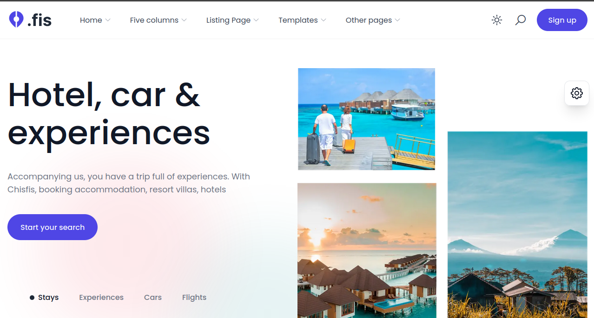

# Chisfis Clone - React Application

This project is a clone of the [*Chisfis Nextjs website*](https://chisfis-nextjs.vercel.app/), built using modern technologies such as React, TypeScript, Zustand, shadcn, Zod, and React-Router. The goal of this project is to strengthen our skills in front-end development by recreating a full-featured, interactive website with a focus on best practices and modern tools.

## Screenshots

**Shrot preview of the hero of the website**


## Table of Contents

- [Chisfis Clone - React Application](#chisfis-clone---react-application)
  - [Screenshots](#screenshots)
  - [Table of Contents](#table-of-contents)
  - [Projet overview](#projet-overview)
  - [Tech Stack](#tech-stack)
  - [Installation and Setup](#installation-and-setup)
  - [Features](#features)
  - [Folder Structure](#folder-structure)
  - [Contributors](#contributors)
 

## Projet overview

The **Chisfis Clone** project aims to replicate the functionality, design, and interactivity of the original Chisfis website. This includes building multiple pages, forms, user authentication, state management, and more. The objective is to practice and apply the skills acquired during our training at [worketyamo](https://worketyamo.com/) in React and consolidate our understanding of various front-end technologies.

Key aspects of this project:

- Interactive and dynamic UI built using React.
- Form validation and schema creation using Zod.
- Efficient state management using Zustand.
- Routing and navigation using React-Router.
- Styling and components with shadcn.
- Uses differents React hook such as useState, useEffect, useMemo, useContext, useCallback, customooks...

## Tech Stack

The following technologies are used in this project:

- React: JavaScript library for building user interfaces.
- TypeScript: Typed superset of JavaScript that adds static types to the code.
- Zustand: Small, fast, and scalable state management solution.
- Zod: TypeScript-first schema validation library.
- React Router: Library for handling in-app navigation.
- shadcn: Modern design system and component library.
- Vite: Front-end build tool for fast development.
- Tailwind-CSS: Utility-first CSS framework for custom designs.
- pnpm and Yarn: for nodejs package management

## Installation and Setup

Follow the steps below to set up the project on your local machine:

1- Clone the repository:

```bash
git clone https://github.com/Chrisfisprojet-rostand


cd Chrisfisprojet-rostand
```

2- Install the dependencies:

```bash
pnpm install
```

3- Run the development server:

```bash
pnpm run dev
```

4- Open the application in your browser:

Navigate to <http://localhost:5173> to see the site in action.

## Features

- **Theming and Customization**: Dynamic theming support using sadcn to enable light and dark mode; Ability to toggle between themes, enhancing user experience.
- **Home Page**: Responsive landing page with various sections.
- **Dynamic Routing with React Router**: Multiple pages with dynamic navigation using React Router; Support for client-side routing, allowing smooth page transitions without reloading; Handling of 404 pages for non-existent routes.
- **State Management**: Efficient and scalable state management using Zustand.
- **Form Handling and Validation with Zod**: User input validation with Zod for robust form handling.
- **Responsive Layout**: The website is fully responsive, adjusting to different screen sizes (mobile, tablet, desktop); Implemented using Tailwind CSS for quick and efficient styling.
- **Reusable Components**: Built with a focus on reusability and maintainability.
- **Clean Code and TypeScript Integration**: Strict type-checking with TypeScript for error prevention.
- **Authentication**: Implementation of a basic authentication system (Login, Signup).; State management for logged-in users using Zustand.
- **Error Boundaries**: Error boundaries implemented to handle unexpected runtime errors and display user-friendly fallback UI
- **Fast Development with Vite** : The project is bootstrapped with Vite for lightning-fast hot module replacement (HMR) during development
- **SEO Optimized**: Implement SEO best practices such as meta tags, alt attributes on images, and proper page titles for improved search engine visibility.

## Folder Structure

Chrisfisprojet-rostand
├── public/
│   ├── favicon.ico/ # add_fiveicon_folder...
│   └──   # add statisques imaes and files
├── src/
│   ├── assets/ #for images and others
│   ├── components/
│   │   ├── custom/ users custom compoments
│   │   ├── ui/ # for shadcn compoments
│   ├── pages/
│   │   ├── Home.tsx
│   │   ├── About.tsx
│   │   └── Contact.tsx
│   ├── hooks/ #for custom ooks
│   ├── store/ # for  zustand store
│   ├── global/
│   │   └── constants/
│   ├── App.tsx
├── .gitignore
├── package.json
├── tsconfig.json
├── tailwind.config.js
├── vite.config.ts
└── README.md

## Contributors

- **Barthez Kenwou**: [**01Barthez**]
- **kwinkwa ketchassorostand**: [**ketchDev-starck**](https://github.com/ketchDev-starck)


## Contributing

Contributions are always welcome!

See `contributing.md` for ways to get started.

Please adhere to this project's `code of conduct`.

## License

This project is licensed under the
[MIT License](https://choosealicense.com/licenses/mit/). See the LICENSE file for details.

## Tanks

Our thanks to [Worketyamo Team](https://worketyamo.com/) for their works and for their support
